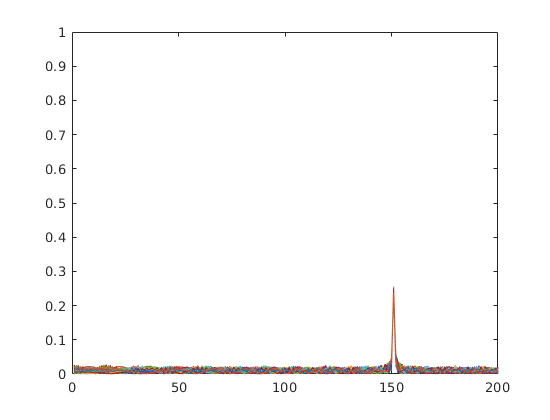
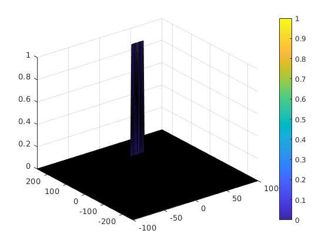
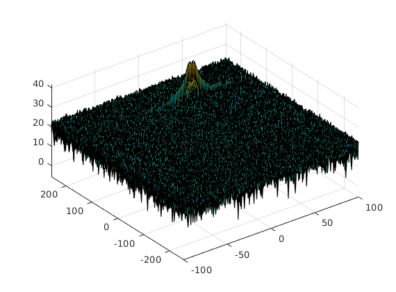

# SFND Radar Target Generation and Detection
---
### FMCW Waveform Design
#### Using the given system requirements, design a FMCW waveform. Find its Bandwidth (B), chirp time (Tchirp) and slope of the chirp.

Implemented in [radar_target_generation_and_detection.m Line 31-33](radar_target_generation_and_detection.m#L31-L33).


### Simulation Loop
#### Simulate Target movement and calculate the beat or mixed signal for every timestamp.

Implemented in [radar_target_generation_and_detection.m Line 64-83](radar_target_generation_and_detection.m#L64-L83).

### Range FFT (1st FFT)
#### Implement the Range FFT on the Beat or Mixed Signal and plot the result.

Implemented in [radar_target_generation_and_detection.m Line 88-119](radar_target_generation_and_detection.m#L88-L119).

Resulting plot for target range of 150m is shown below:



### 2D CFAR
#### Implement the 2D CFAR process on the output of 2D FFT operation, i.e the Range Doppler Map.

Implemented in [radar_target_generation_and_detection.m Line 152-218](radar_target_generation_and_detection.m#L152-L218).

Resulting plot for target range of 150m and velocity of 30m/s is shown below:



#### 2D CFAR implementation detail

Output array of zeroes with same size as Range-Doppler Map(RDM) is created for saving result. This will remove the need of suppressing the non-thresholded cells(since array elements are zero initially).

```Matlab
CFAR = zeros(size(RDM));
```

Number of Training and Guard cells were tuned by trial and error.

```Matlab
% *%TODO* :
%Select the number of Training Cells in both the dimensions.
Tr = 20;  % Number of Training band rows
Tc = 10;  % Number of Training band columns

% *%TODO* :
%Select the number of Guard Cells in both dimensions around the Cell under 
%test (CUT) for accurate estimation
Gr = 5;   % Number of Guard band rows
Gc = 5;   % Number of Guard band columns

%Number of total training cells
Nt = (2*(Tc + Gc)+1) * (2 * (Tr + Gr)+ 1) - ((2 * Gr + 1) * (2 * Gc +1));
```

Offset was also selected by trial and error.
```Matlab
% *%TODO* :
% offset the threshold by SNR value in dB
offset = 10;
```

To calculate noise level on every possible position in the 2d RDM array double loop is performed:

```Matlab
for row1 = Tr + Gr + 1:Nr/2 - (Tr + Gr)
    for col1 = Tc + Gc +1:Nd - (Tc + Gc)
        ...

    end
end
```

In above mentioned loop, noise level is calculated by averaging signal offer training cells:

```Matlab
    % Use RDM[x,y] as the matrix from the output of 2D FFT for implementing CFAR
    tmp = 0;
    for row2 = row1 - (Tr + Gr) : row1 + (Tr + Gr)
        for col2 = col1 - (Tc + Gc) : col1 + (Tc + Gc)
            if (abs(row1 - row2) > Gr || abs(col1 - col2) > Gc)
                tmp = tmp + db2pow(RDM(row2, col2));
            end
        end
    end
    noise_level(row1, col1) = tmp/Nt;
```

Once noise level is calculated, threshold for that particular cell can be calculated by adding the offset:

```Matlab
    noise_level_db = pow2db(noise_level(row1, col1));
    threshold_db = noise_level_db + offset;
```

Finally, Cell Under Test(CUT) value is compared to threshold value and output is set accordingly:

```Matlab
    CUT = RDM(row1, col1);

    if CUT > threshold_db
        CFAR(row1, col1) = 1;
    else
        CFAR(row1, col1) = 0;
    end
```

Range-Doppler Map before applying 2D CFAR(target range=150m, target velocity=30m/s):



2D CFAR result(target range=150m, target velocity=30m/s):


